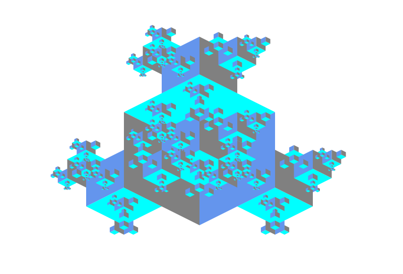

# Assignment discription

Recursive Cubes 
----



Rainbow 
-----


# JavaFx 11

<ul>
<li>
clone in your computer: 

```
git clone http://apj.ce.kntu.ac.ir/git/root/<YOUR_REPO_URL>
cd YOUR_REPO_URL
```


</li>
<li>
    <p>Run Javafx GUI</p>
    
```
mvn clean javafx:run
```

</li>

<li>
    <p>Run tests</p>
    
```
mvn clean test
```
</li>

<li>
<p> push your change to the repository: </p>
 
```
git add .
git commit -m "commit message"
git push
```
</li>
</ul>
